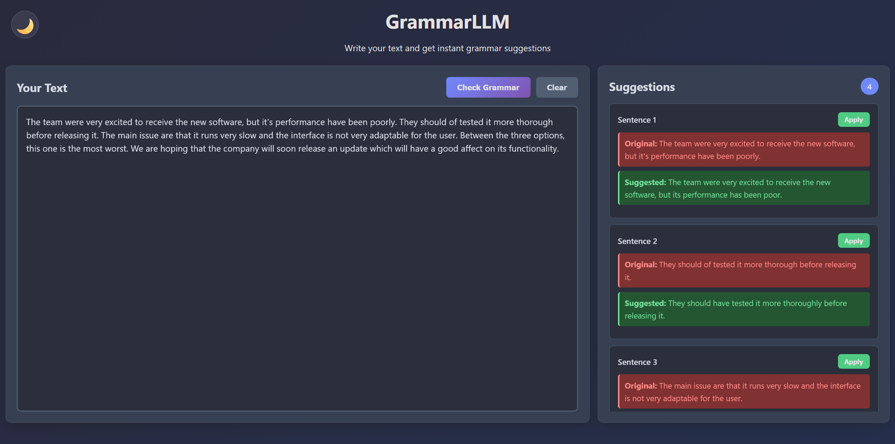

# GrammarLLM
AI-powered grammar correction tool using fine-tuned language models to fix grammatical errors in text.

[](https://buymeacoffee.com/icecubetr)




## Features

- Real-time grammar and spelling correction
- AI-powered suggestions using fine-tuned LLMs
- Individual suggestion acceptance
- Clean, responsive web interface
- FastAPI backend with llama.cpp integration
- Support for multiple grammar models
- Doesn't require a GPU

## Docker Deployment

### Using Docker Compose (Recommended)
```bash
docker-compose up -d
```

## Installation

1. Clone the repository:
```bash
git clone https://github.com/whiteh4cker-tr/grammar-llm.git
cd grammar-llm
```

2. Create a virtual environment (recommended):
```bash
python -m venv venv
source venv/bin/activate  # On Windows: venv\Scripts\activate
```

3. Install dependencies:
```bash
pip install -r requirements.txt
```
## Usage

1. Start the application:
```bash
uvicorn main:app --reload --host 0.0.0.0 --port 8000
```
2. Open your browser and navigate to:
```text
http://localhost:8000
```

## Configuration
The application uses the GRMR-V3-G4B-Q8_0 model by default. The model will be automatically downloaded on first run (approx. 4.13GB).
