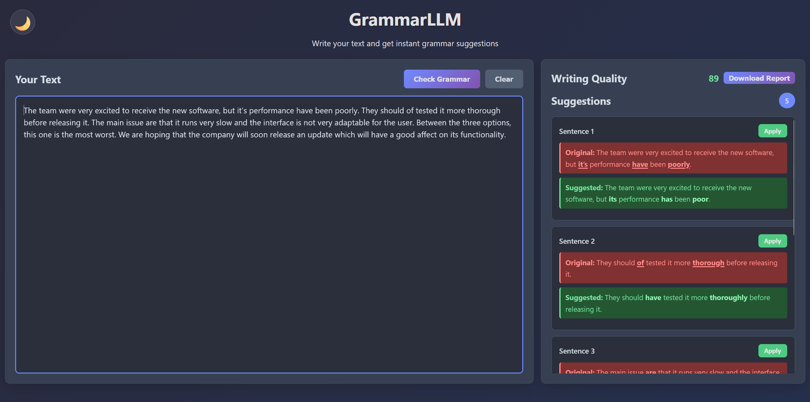

# GrammarLLM
AI-powered grammar correction tool using fine-tuned language models to fix grammatical errors in text.

[](https://buymeacoffee.com/icecubetr)




## Features

- Real-time grammar and spelling correction
- AI-powered suggestions using fine-tuned LLMs
- Individual suggestion acceptance
- Clean, responsive web interface
- FastAPI backend with llama.cpp integration
- Support for multiple grammar models
- Doesn't require a GPU

## Docker Deployment

### Using Docker Compose (Recommended)
```bash
docker-compose up -d
```

## Installation

1. Clone the repository:
```bash
git clone https://github.com/whiteh4cker-tr/grammar-llm.git
cd grammar-llm
```

2. Create a virtual environment (recommended):
```bash
python -m venv venv
source venv/bin/activate  # On Windows: venv\Scripts\activate
```

3. Install dependencies:
```bash
pip install -r requirements.txt
```
## Usage

1. Start the application:
```bash
uvicorn main:app --reload --host 0.0.0.0 --port 8000
```
2. Open your browser and navigate to:
```text
http://localhost:8000
```

## Example Usage

### Web Interface
Simply paste or type your text in the editor and click "Check Grammar". The application will analyze your text and display suggestions.

### API Usage
The application exposes a REST API for programmatic access:

```bash
# Send text for correction
curl -X POST "http://localhost:8000/correct" \
  -H "Content-Type: application/json" \
  -d '{"text": "your text here"}'
```

## Configuration
The application uses the GRMR-V3-G4B-Q8_0 model by default. The model will be automatically downloaded on first run (approx. 4.13GB).

## Functionality Documentation

### Core Features

**Grammar Correction Endpoint**
- **Endpoint**: POST `/correct`
- **Request Body**: `{"text": "your text here"}`
- **Response**: Returns a `CorrectionResponse` object containing:
  - `suggestions`: List of grammar corrections with original text, corrected text, and span information
  - `corrected_text`: The fully corrected version of the input text

**Apply Suggestion Endpoint**
- **Endpoint**: POST `/apply-suggestion`
- **Use Case**: Apply a single suggestion to the original text
- **Request Parameters**: Original text, suggestion index, and suggestions list

**Apply Multiple Suggestions Endpoint**
- **Endpoint**: POST `/apply-suggestions`
- **Use Case**: Apply multiple suggestions to the original text at once
- **Features**: Handles overlapping suggestions intelligently by keeping the rightmost replacement
- **Note**: This endpoint is available for programmatic API clients. The web frontend applies suggestions one at a time using the `/apply-suggestion` endpoint instead.

**Health Check Endpoint**
- **Endpoint**: GET `/health`
- **Response**: Returns status of the application

### Model Details
- **Model**: GRMR-V3-G4B (Quantized to 8-bit)
- **Context Window**: 4096 tokens
- **Capabilities**: Grammar correction, spelling correction, punctuation fixes, and style improvements
- **GPU Required**: No - runs on CPU with llama.cpp

## Testing & Verification

### Manual Testing Steps

1. **Verify Application Start**
   ```bash
   uvicorn main:app --reload --host 0.0.0.0 --port 8000
   ```
   Expected console output:
   ```
   ============================================================
   GrammarLLM
   ============================================================
   Server starting on http://localhost:8000
   (Also accessible on http://127.0.0.1:8000)
   ============================================================
   ```

2. **Test Health Check**
   ```bash
   curl http://localhost:8000/health
   ```
   Expected response: `{"status":"healthy","model_loaded":true}`

### Docker Testing
```bash
docker-compose up
curl http://localhost:8000/health
```
Expected: Application is accessible and responsive

## Community Guidelines

### Contributing
We welcome contributions from the community! Here's how you can help:

1. **Fork the Repository**
   ```bash
   git clone https://github.com/whiteh4cker-tr/grammar-llm.git
   cd grammar-llm
   ```

2. **Create a Feature Branch**
   ```bash
   git checkout -b your-feature-name
   ```

3. **Make Your Changes**
   - Ensure your code follows the existing style
   - Test your changes thoroughly
   - Update documentation as needed

4. **Submit a Pull Request**
   - Push your changes to your fork
   - Open a pull request describing your changes
   - Link any related issues
   - Wait for review and feedback

### Reporting Issues
Found a bug or have a feature request? Please open an issue on GitHub:

1. **Check existing issues** to avoid duplicates
2. **Provide detailed information**:
   - Description of the problem
   - Steps to reproduce
   - Expected vs. actual behavior
   - System information (OS, Python version, etc.)
   - Console output or error messages

3. **Use clear titles and descriptions**

### Getting Support
- **GitHub Issues**: For bug reports and feature requests
- **Documentation**: Check the README and code comments for detailed information
- **Discussions**: Use GitHub Discussions for general questions and support

### Code of Conduct
Please be respectful and constructive in all interactions with other community members.
