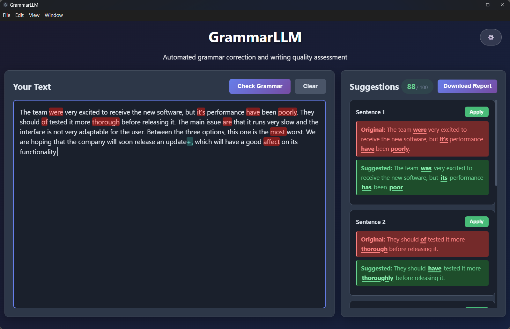

# GrammarLLM — Electron Desktop

A local-first grammar correction and writing quality assessment desktop application built with **Electron, React, TypeScript, and Vite**. It runs a fine-tuned LLM (GRMR-V3-G4B) entirely on your machine — no internet connection, no servers, no API keys, no data leaving your computer.

This is the **`electron` branch** — a full migration of the original [GrammarLLM](https://github.com/whiteh4cker-tr/grammar-llm/tree/python) (Python FastAPI + vanilla JavaScript web app) into a native desktop app. See [Differences from the python branch](#differences-from-the-python-branch) below.

[](https://buymeacoffee.com/icecubetr)




---

## Features

- **Real-time grammar & spelling correction** — sentence-level error detection using the GRMR-V3-G4B LLM (quantized Q4_K_M or Q8_0)
- **AI-powered suggestions** — per-sentence suggestion cards with word-level highlighted diffs (red = error, green = correction)
- **Word-level corrections in the editor** — after a check, misspelled words are highlighted in light red directly in your text (insertions the model suggests appear as green `+` markers); hovering shows the corrected word in a popup right under it, and one click replaces, **inserts** (e.g., a missing comma) or **deletes** (e.g., a repeated word) — no need to use the suggestions panel. Applying a fix automatically **re-checks just that sentence** (the engine corrects sentences independently, so the rest of your text is left untouched) and keeps all other suggestions valid
- **Apply suggestions individually** — one click replaces the error span in your text; applied suggestions are tracked and filtered
- **Writing quality score (0–100)** — computed from the error-to-word ratio, updated after every check
- **PDF report generation** — WCAG 2.0 AA–compliant, downloadable report with the score, all suggestions, and highlighted original/corrected sentences (jsPDF)
- **Settings hub** — gear button (top-right) opens Settings: **General** (light/dark theme, word-level corrections toggle — enabled by default, persisted) and **LLM** (context size, model management)
- **Model manager** — under **Settings → LLM**, manage your models:
  - **GRMR-V3-G4B-Q4_K_M** — *Recommended*: faster, smaller download
  - **GRMR-V3-G4B-Q8_0** — *Highest quality*: slower, larger download (~4 GB)
  - **Custom GGUF URL** — paste a direct link to any .gguf model (e.g., from Hugging Face)
  - Switch between installed models, delete models to free space, download with progress bar + cancel (resumable); selection persists across restarts
- **Multi-backend GPU support** — llama.cpp via [node-llama-cpp](https://github.com/withcatai/node-llama-cpp) with **automatic detection**: CUDA (NVIDIA), Metal (Apple Silicon), Vulkan (AMD/Intel/NVIDIA), CPU fallback — zero configuration
- **Fully offline & private** — model runs locally; nothing is ever sent to a server
- **Secure by design** — sandboxed renderer, `contextIsolation`, typed IPC bridge via `contextBridge` (no raw `ipcRenderer` in the UI)
- **Dark/light theme** — dark mode default, persisted across sessions; switch anytime in Settings. The model download screen matches the chosen theme (light `#F0F0F0` background in light mode)
- **Keyboard shortcut** — `Ctrl+Enter` (or `Cmd+Enter`) to check grammar
- **Smart editing detection** — editing your text automatically clears stale suggestions

## Tech Stack

| Layer | Technology |
|---|---|
| Desktop shell | Electron 43 |
| UI | React 19 + TypeScript + Vite 8 |
| LLM inference | [node-llama-cpp](https://github.com/withcatai/node-llama-cpp) (llama.cpp) — CPU / CUDA / Metal / Vulkan |
| Model downloads | node-llama-cpp `createModelDownloader` (resumable, parallel) |
| Validation | zod (IPC payloads) |
| Diff highlighting | jsdiff (`diff`) |
| PDF reports | jsPDF |
| Tests | vitest (135 unit tests) |
| Linting | oxlint |
| Packaging | electron-builder (dmg / AppImage / portable / msi) |

## Getting Started

### Requirements

- Node.js 20+
- npm

### Development

```bash
npm install
npm run dev:electron     # builds React + compiles main process, then launches the app
```

On first launch you'll see the model download screen. Pick a model (~2–4 GB, resumable) and the editor opens.

> The model is stored in `./models` (dev), next to the exe for **portable** builds, or the OS user-data directory (installed builds). Never committed.

### Scripts

| Script | Purpose |
|---|---|
| `npm run dev:electron` | Build everything and launch the Electron app |
| `npm run dev:react` | Vite dev server only (http://localhost:8000) |
| `npm run test` | Run the vitest suite |
| `npm run lint` | oxlint |
| `npm run build` | Full build: `tsc -b` + `vite build` + electron compile |
| `npm run dist` | Package for the current platform (electron-builder) |
| `npm run dist:mac` | macOS arm64 dmg (run on macOS) |
| `npm run dist:win` | Windows x64 portable + msi (run on Windows) |
| `npm run dist:linux` | Linux x64 AppImage (run on Linux) |

## How It Works

1. **Model gate** — on startup the app checks for a `.gguf` model; if none exists, the download screen is shown. Once a model is loaded, the **Settings** gear (top-right) → **LLM** reopens model management: switch between installed models, delete models, or download more — including a **custom GGUF URL**.
2. **Correction pipeline** (per check): split text into sentences (abbreviation/decimal-aware) → for each sentence, prompt the LLM with a fixed system prompt and a **fresh chat history** (each sentence corrected independently) → clean the model output (strip prefixes, template tags, repeated segments) → validate (reject quote-only changes, >2× length explosions, >1.5× suggestion bloat) → diff words → reconstruct the full text preserving original spacing.
3. **Word-level fixes** — the same token diff that drives the suggestion cards also produces per-word error spans with absolute positions: replacements, **insertions** (zero-width spans, shown as green `+` markers) and **deletions** (highlighted words with a Delete popup). When word-level corrections are enabled (default), the editor renders a highlight layer behind the text. Hovering a highlighted word shows the fix beneath it; clicking applies the change and triggers a **debounced re-check of only that sentence** — the result is merged back into the suggestion list, with the positions of later suggestions shifted to match the edited text.
4. **Suggestions** — only meaningful corrections become cards; hovering a card highlights the sentence in your editor; Apply replaces the span.
5. **Score** — `round(100 × (1 − errorWords / totalWords))`.
6. **Report** — jsPDF builds the A4 report with WCAG-compliant colors and word-wrap.

## Testing

```bash
npm run test
```

135 unit tests cover the core engine (sentence splitting edge cases, cleaning rules, diff highlighting, word-fix extraction — including insertions, deletions and combined word+punct runs, reconstruction fidelity, apply/overlap logic), the model manager lifecycle (download/cancel/error states, selection persistence, settings persistence, delete), IPC schema validation, the overlay helpers, and the sentence re-check merge logic. Tests never download a model — the LLM layer is exercised manually.

## Packaging

```bash
npm run dist:win    # or dist:mac / dist:linux (build on the target OS)
```

- Output lands in `dist/`
- node-llama-cpp native binaries are unpacked from the asar archive (`asarUnpack`) — required for the packaged app to run
- App icon: `desktopIcon.png` (512×512)
- Artifacts are named after `productName` (e.g. `GrammarLLM 1.4.0.exe`)
- **Portable builds store models in a `models` folder next to the exe** (via `PORTABLE_EXECUTABLE_DIR`); installed builds use the user-data directory. Keep the exe in a writable folder (not `Program Files`).
- Installs are unsigned by default (`CSC_IDENTITY_AUTO_DISCOVERY=false`); set `CSC_LINK`/`CSC_KEY_PASSWORD` when you have a signing certificate

## Differences from the python branch

| Aspect | `python` branch (original) | `electron` branch (this) |
|---|---|---|
| **Form factor** | Web app — browser + Python server | Native desktop app (Electron) |
| **Backend** | FastAPI + uvicorn REST server | No server — main-process IPC (`ipcMain`/`contextBridge`) |
| **Language** | Python (backend) + vanilla JS (frontend) | TypeScript end-to-end (Electron, React, Node) |
| **Inference** | `llama-cpp-python` (CPU-only) | `node-llama-cpp` — **CPU, CUDA, Metal, Vulkan** auto-detected |
| **Model loading** | Auto-downloads fixed Q8_0 model from Hugging Face | Model manager: **Q4_K_M / Q8_0 / custom GGUF URL**, progress bar, cancel, resume, **switch between installed models**, delete, persisted selection |
| **Frontend** | Vanilla HTML/CSS/JS (`script.js`, `jspdf.umd.min.js`) | React 19 + TypeScript components |
| **API surface** | REST endpoints (`/correct`, `/apply-suggestion`, `/health`) | Typed `window.api` over IPC (zod-validated) |
| **Data validation** | Pydantic models | zod schemas |
| **Word diff** | Python `difflib` | jsdiff (`diffArrays`) |
| **PDF report** | jsPDF via CDN script | jsPDF npm package (same WCAG layout, unit-tested builder) |
| **Privacy** | Client-server (data crosses the network) | **Fully offline** — model runs locally, no data leaves the machine |
| **Packaging** | Docker / `uvicorn` | electron-builder installers: dmg, AppImage, portable exe, msi |
| **Testing** | None | 135 vitest unit tests (engine, model manager, schemas, overlay helpers, re-check merge) |
| **Chrome extension** | Included in repo | Out of scope (separate artifact) |

### What was preserved

- The correction engine behavior is a **bug-for-bug port** of `main.py` (sentence splitting heuristics, cleaning rules, validation thresholds, whitespace-preserving reconstruction, overlap-safe bulk apply) — verified with the original README's example output as a test fixture
- The UI design language: same colors, dark-mode default, WCAG-compliant highlights and report
- The model: same GRMR-V3-G4B GGUF family (repo: `icecubetr/GRMR-V3-G4B-GGUF`)
